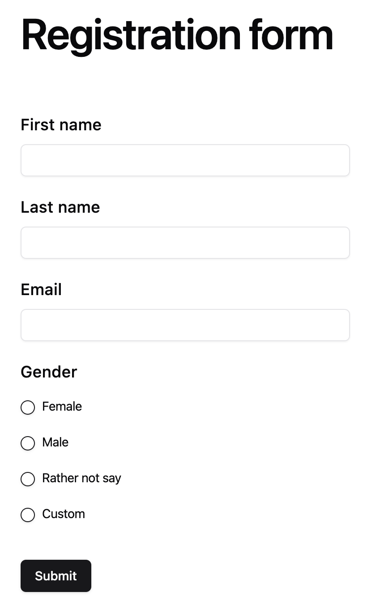

<h1 align="center">Opensurvey</h1>

<h2 align="center">The open-source form builder for everyone</h2>

The ultimate service for creating multiple forms in record time

 
 

## Demo

[OpenSurvey Demo](https://opensurvey.vercel.app/)

Our SaaS is in beta. It may contain bugs and is best suited for small projects. Critical processes are discouraged, and demo data may be erased.

## ⭐️ Why OpenSurvey?

OpenSurvey, the open-source alternative to Google Docs and Typeform empowers users to craft short-answer and multiple-choice questions effortlessly. Its simplicity and speed are unmatched. Plus, for those seeking privacy and control, it offers a self-hosting option. Choose OpenSurvey for elegant, transparent, efficient survey creation.

## ☁️ Self Host

Currently I'm hosting the demo in Vercel for hosting the Nextjs App and Supabase for the PostgreSQL database.
I decided to use this platsforms because both give a nice free trial plans. So everyone can host their own
opensurvey free.

## 🚀 Have a feature request?

For new feature requests, create an issue explaining what you want and why you need it.

## 💻 Need Help?

If you need help, please post your questions in the 'issues' section of the repository.

## Development commands

## Prisma

### Update db

npx prisma db push
npx prisma generate

### db migrate

npx prisma migrate dev --name init

### run seeds

npx prisma db seed

### Prisma Studio

npx prisma studio

### Prisma reset database

npx prisma migrate reset
